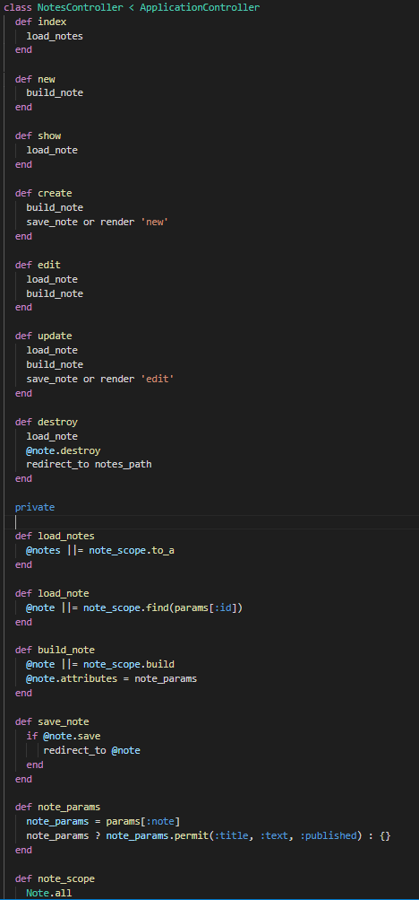
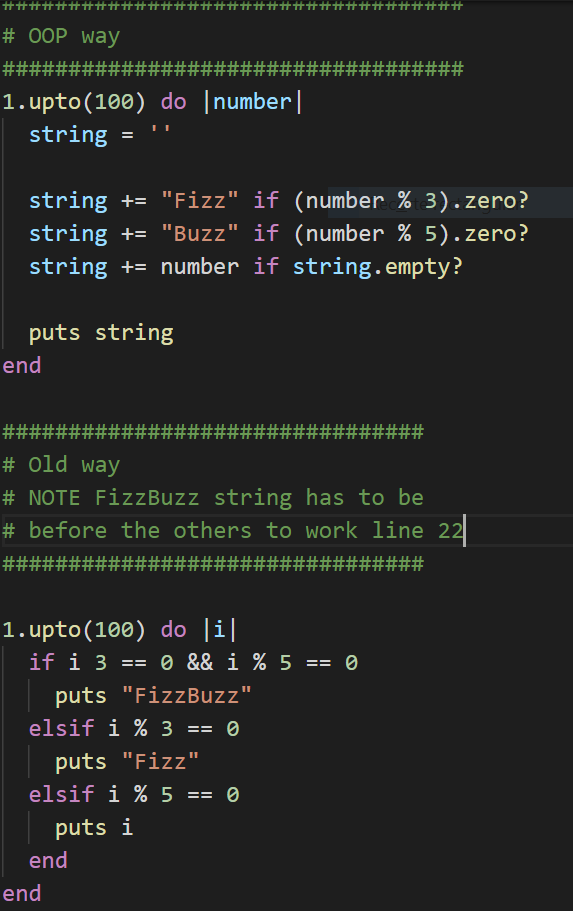
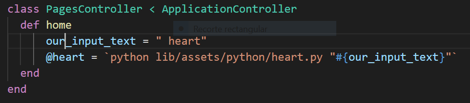
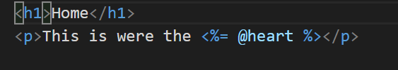
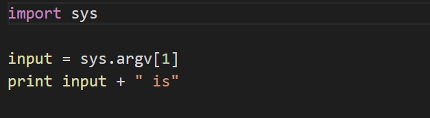
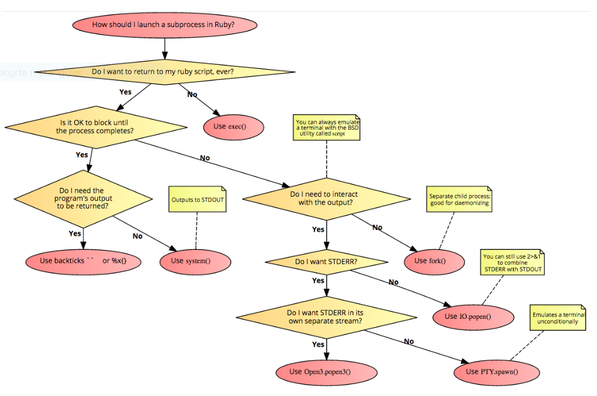

# This app has the purpose to record the best coding techniques

Notes controller section all the CRUD has been done in other way

* Fizz Buzz example
the root is  app/ObjectOrientedDesign

Things you may want to cover:

# How to use python inside Rails
https://stackoverflow.com/questions/7212573/when-to-use-each-method-of-launching-a-subprocess-in-ruby

* create a controller page home (NOTE the code uses # backtick  )

* inside lib/assets create a folder name python and a file name heart.py on it
lib/assets/python/heart.py 

# jekyll add it to rails the proccess explain here

https://www.sitepoint.com/jekyll-rails/

https://medium.com/@halfbyte/jekyll-within-rails-on-heroku-b53e9c64502

https://jan.krutisch.de/en/2016/09/24/jekyll-with-rails-on-heroku.html

https://thomasvaeth.github.io/trophy-jekyll/

http://thomasvaeth.com/trophy/

* Configuration

* Database creation

* Database initialization

* How to run the test suite

* Services (job queues, cache servers, search engines, etc.)

* Deployment instructions

* ...
